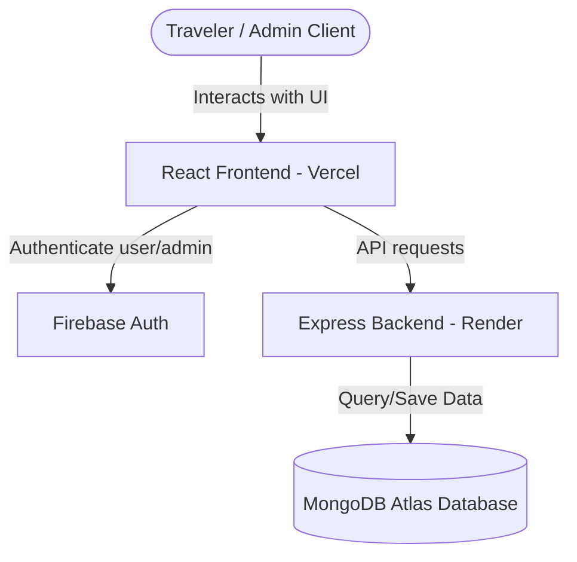
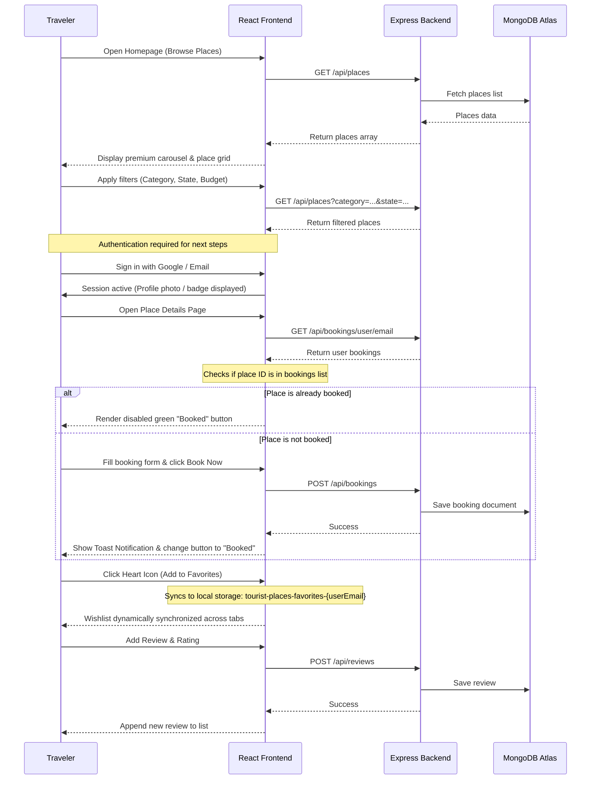
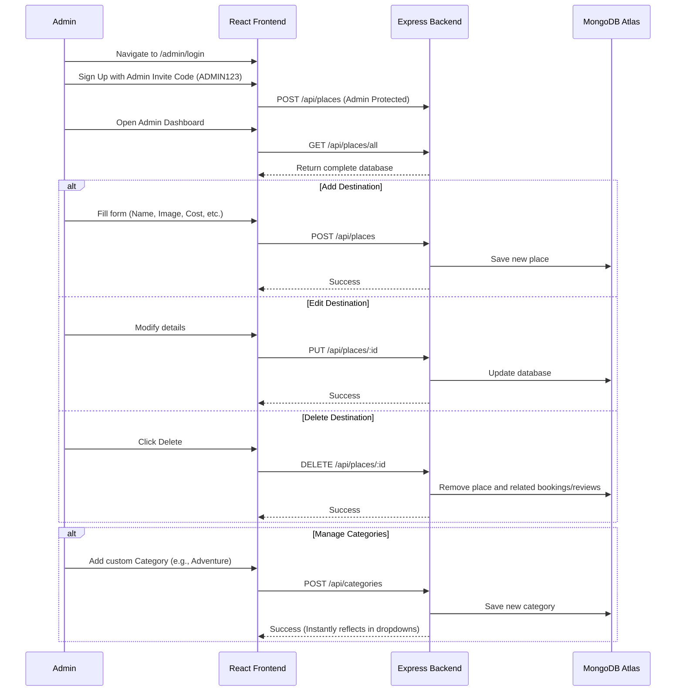

# Yatra Explorer (Tourist Places Explorer) - Project Flow & Architecture Documentation

This document provides a comprehensive overview of the architecture, data flows, user roles, database schema, and deployment setups for the **Yatra Explorer** MERN Stack application.

---

## 1. Project Architecture Overview

Yatra Explorer is built using the MERN stack with external authentication, providing a secure, responsive, and real-time experience.



*   **Frontend:** React (Single Page Application) styled using premium vanilla CSS, hosted on **Vercel**.
*   **Backend:** Node.js & Express REST API hosted on **Render**.
*   **Database:** MongoDB Atlas (Cloud NoSQL database).
*   **Authentication:** Firebase Authentication (handling Google Sign-In and secure Email/Password registration).

---

## 2. User Roles and Interactive Flows

The application supports two distinct roles: **Travelers (Users)** and **Administrators (Admins)**.

### A. Traveler (User) Flow & Features



#### Detailed Traveler Journey:
1.  **Exploration (Public):**
    *   Browse places through a responsive homepage containing a premium featured destination banner carousel.
    *   Search and filter places instantly by **State**, **Budget Tier (Low, Medium, Luxury)**, and **Category (Beach, Hill Station, Temple, City)**.
    *   Voice Search utilizes the browser's web speech recognition API to translate voice inputs directly into the search bar.
2.  **Authentication:**
    *   Register or Log In using a secure Email/Password form or a single-click Google Sign-In popup.
    *   Once authenticated, a custom profile picture (or dynamic letter initial badge fallback) is displayed in the navigation bar.
3.  **Detailed Analysis:**
    *   Click on any place to open its dedicated details view (displaying coordinates, entry fees, descriptions, and user ratings).
4.  **Booking System:**
    *   Enter travel dates and group sizes to confirm a booking.
    *   **Double-Booking Guard:** The frontend checks existing bookings for the currently logged-in user. If they have already reserved the destination, the booking button changes to a disabled green `"Booked"` button of matching dimensions to prevent duplicate bookings.
5.  **Wishlist (Favorites):**
    *   Toggle a place into your wishlist using the heart icon.
    *   Favorites are stored under a user-specific storage key (`tourist-places-favorites-${userEmail}`) so wishlists are kept private between different accounts on the same computer and synchronized in real-time.
6.  **Reviews and Feedback:**
    *   Write text feedback and choose a rating. The aggregate rating score updates dynamically.

---

### B. Administrator (Admin) Flow & Features

To maintain a secure portal, the admin link is excluded from public navigation bars. Admins access their portal directly by typing `/admin/login` into the browser URL bar.



#### Detailed Admin Capabilities:
1.  **Registration Validation:**
    *   Admins register using an email and password along with a secret **Invite Code** (`ADMIN123`). This keeps the portal safe from unauthorized sign-ups.
2.  **CRUD Management:**
    *   **Create:** Add new tourist places with attributes like name, city, state, description, entry fee, location, and photo URL.
    *   **Read:** View all destinations in a table layout, complete with overall ratings and quick metrics.
    *   **Update:** Edit descriptions, entry fees, or upload new images for existing destinations.
    *   **Delete:** Remove places from the database.
3.  **Dynamic Category Control:**
    *   Create new categories (e.g. *Adventure*, *Wildlife*) via the dashboard. These are saved to a separate database collection and instantly populate the search filtering dropdowns for travelers on the homepage.

---

## 3. Database Schema Models (NoSQL)

MongoDB stores the data inside four distinct collections:

### A. Places Collection (`places`)
Stores information about the destinations.
```json
{
  "_id": "ObjectId",
  "name": "String",
  "state": "String",
  "city": "String",
  "image": "String (URL)",
  "description": "String",
  "bestTime": "String",
  "entryFee": "Number",
  "rating": "Number (Computed average, default 0)",
  "location": "String",
  "category": "String",
  "budget": "String (Low / Medium / Luxury)",
  "createdAt": "Date"
}
```

### B. Bookings Collection (`bookings`)
Keeps track of reservations.
```json
{
  "_id": "ObjectId",
  "placeId": "String (Reference)",
  "userEmail": "String",
  "userName": "String",
  "bookingDate": "Date",
  "numberOfPeople": "Number",
  "createdAt": "Date"
}
```

### C. Reviews Collection (`reviews`)
Stores reviews written by users.
```json
{
  "_id": "ObjectId",
  "placeId": "String (Reference)",
  "userEmail": "String",
  "userName": "String",
  "userPhoto": "String (URL)",
  "rating": "Number (1-5)",
  "comment": "String",
  "createdAt": "Date"
}
```

### D. Categories Collection (`categories`)
Dynamic categories created by admins.
```json
{
  "_id": "ObjectId",
  "name": "String (Unique)",
  "createdAt": "Date"
}
```

---

## 4. Main API Endpoints

The Express server handles these endpoints (all calls prefix with `/api`):

| Method | Endpoint | Description |
| :--- | :--- | :--- |
| **GET** | `/places` | Fetch filtered destinations for grid |
| **GET** | `/places/all` | Fetch all destinations (unfiltered) |
| **GET** | `/places/:id` | Fetch details of a single destination |
| **POST** | `/places` | Add a new destination |
| **PUT** | `/places/:id` | Update destination details |
| **DELETE**| `/places/:id` | Delete a destination |
| **POST** | `/bookings` | Create a booking |
| **GET** | `/bookings/user/:email`| Get bookings made by a traveler |
| **DELETE**| `/bookings/:id` | Cancel/Delete a booking |
| **POST** | `/reviews` | Submit a rating and review |
| **GET** | `/reviews/:placeId` | Get all reviews for a destination |
| **GET** | `/reviews/user/:email` | Get reviews written by a traveler |
| **DELETE**| `/reviews/:id` | Delete a review |
| **GET** | `/categories` | Fetch all available categories |
| **POST** | `/categories` | Add a new category |

---

## 5. Security & Build Optimizations

1.  **Axios Global Interceptor:**
    An interceptor configured in `index.js` dynamically checks outgoing calls to `localhost:5000` and replaces the prefix with the hosted Render backend URL, eliminating the need to update hardcoded local host strings.
2.  **Environment Variable Injection:**
    Sensitive data (Firebase API configurations, admin codes, and MongoDB connection keys) are kept out of source control. They are injected at compile time via Vercel (frontend) and Render (backend) dashboards.
3.  **Strict Production Checks:**
    The React build configuration enforces zero ESLint warnings (`CI=true`), guaranteeing that the application is clean, fast, and optimized.
